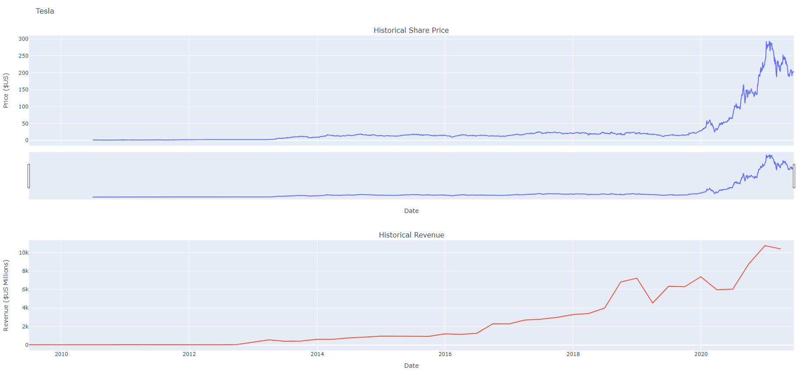

# Stock Data Dashboard

This repository contains Python code for extracting stock data and revenue, plotting them on a dashboard using Plotly, and saving the result as an HTML file.

In this example, we used Tesla and GameStop.

## Getting Started

### Prerequisites

Make sure you have Python installed on your machine. You can download it from [python.org](https://www.python.org/downloads/).

Install the required packages using the following command:

```bash
pip install pandas plotly
pip install yfinance==0.1.67
pip install bs4==4.10.0 -y
pip install nbformat==4.2.0

Dashboard example:


